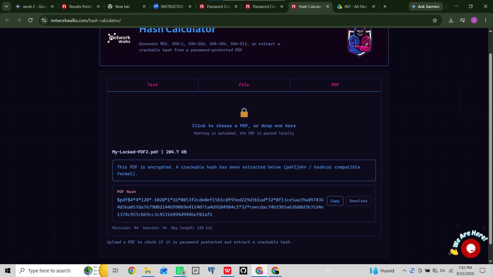
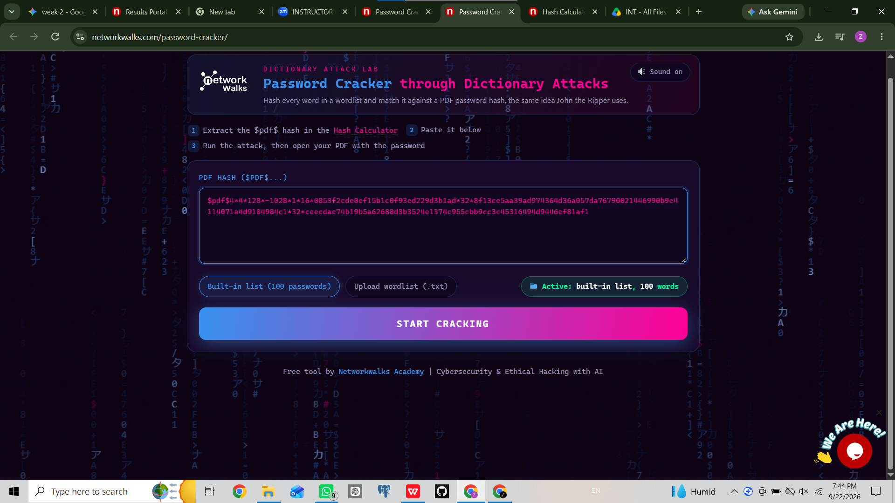
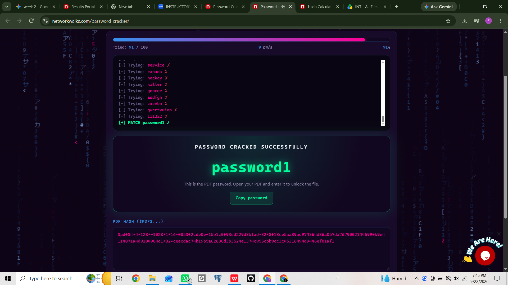
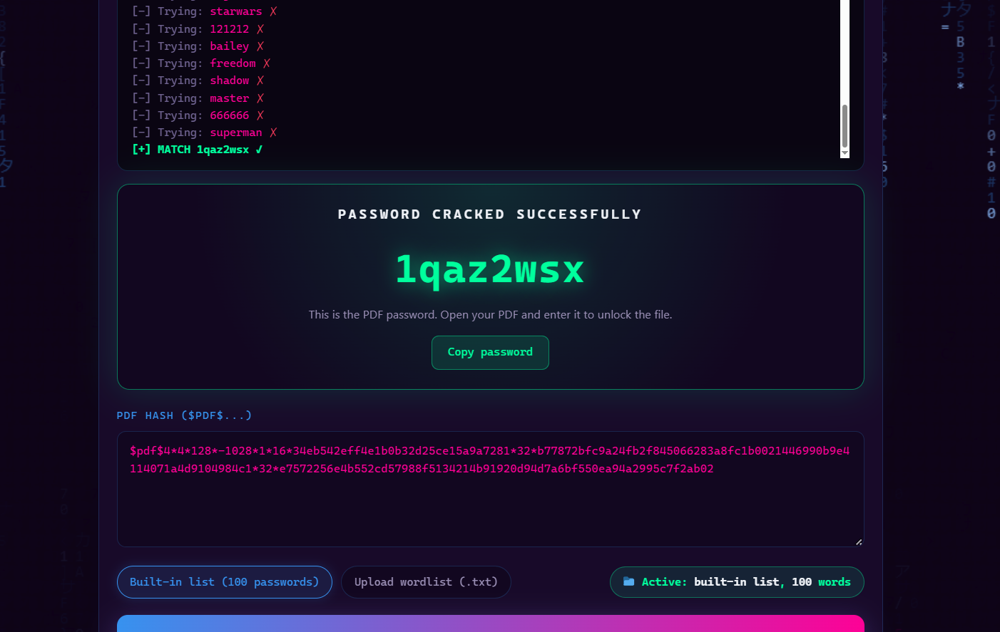
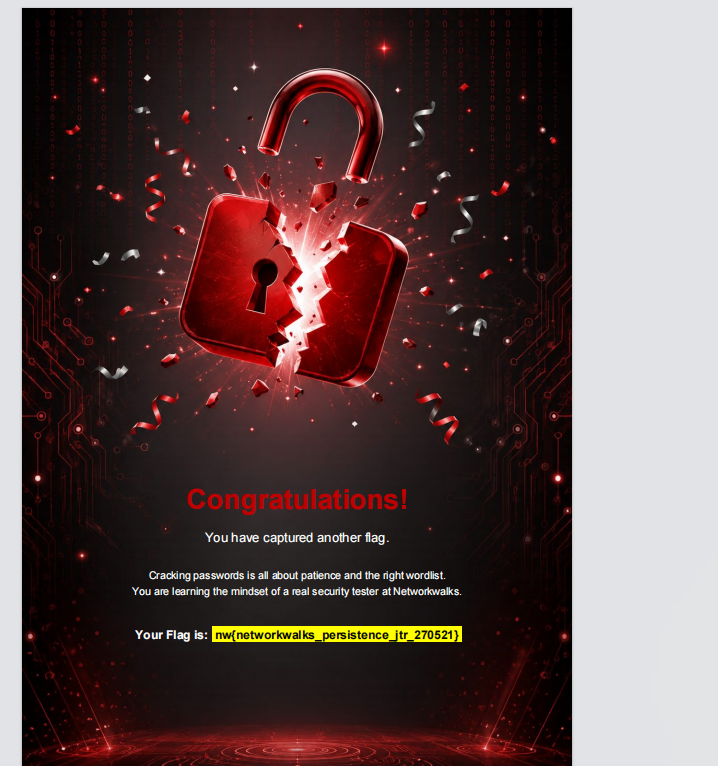
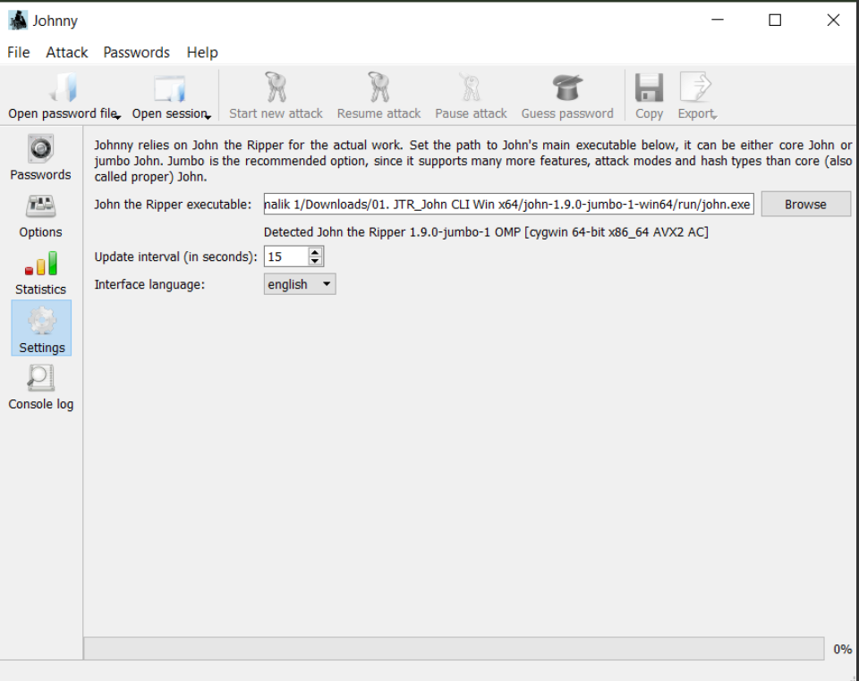
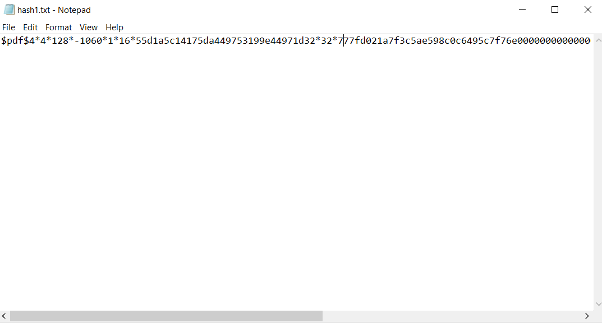
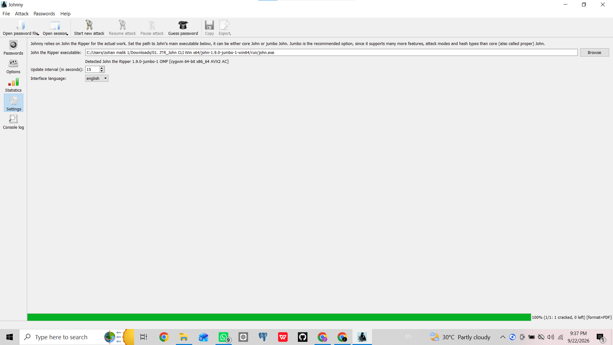
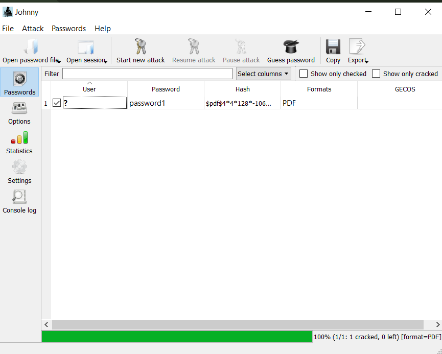
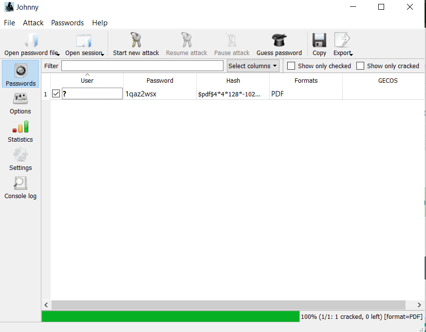

# 🛡️ Cybersecurity Internship
## Week 3: Password Cracking & Hash Analysis Project

A comprehensive, hands-on penetration testing lab report focusing on cryptographic hash extraction, offline password auditing, and brute-force/dictionary attacks utilizing **John the Ripper (CLI)**, **Johnny GUI**, and web-based utilities.

---

## 📌 Executive Summary & Project Overview

During Week 3 of the cybersecurity internship program, practical assessments were performed to evaluate the resilience of cryptographic hashes and encrypted files (such as password-protected PDF documents). 

In this project, we successfully completed two primary tasks: first, using the **Networkwalks web-based calculator** for hash generation, file conversion, and online dictionary attacks; and second, performing offline cryptographic hash extraction and auditing using **John the Ripper (JTR)** and **Johnny GUI** to uncover weak, predictable passwords and recover hidden flags.

---

## 🛠️ Technical Stack & Tools Utilized

* **Primary Environment:**&nbsp;&nbsp;&nbsp;&nbsp;&nbsp;&nbsp;&nbsp;&nbsp;&nbsp;&nbsp;Windows Operating System
* **Offline Cracking Suite:**&nbsp;&nbsp;&nbsp;&nbsp;&nbsp;&nbsp;&nbsp;John the Ripper (JTR) - Jumbo Edition (`john.exe`)
* **Graphical Interface (GUI):**&nbsp;&nbsp;&nbsp;&nbsp;Johnny Password Cracker Frontend
* **Web-Based Utilities:**&nbsp;&nbsp;&nbsp;&nbsp;&nbsp;&nbsp;&nbsp;&nbsp;&nbsp;&nbsp;Networkwalks Hash Calculator & Online Password Cracker
* **Target Artifacts:**&nbsp;&nbsp;&nbsp;&nbsp;&nbsp;&nbsp;&nbsp;&nbsp;&nbsp;&nbsp;&nbsp;&nbsp;&nbsp;Password-protected / encrypted PDF files
* **Outcome Status:**&nbsp;&nbsp;&nbsp;&nbsp;&nbsp;&nbsp;&nbsp;&nbsp;&nbsp;&nbsp;&nbsp;&nbsp;&nbsp;&nbsp;&nbsp;100% Attack Success Rate (Credentials & Flags Successfully Recovered)
## 🚀 Part 1: Password Cracking Process

## 🚀 Part 1: Password Cracking Process

### Step 1.1: Networkwalks Hash Calculator Interface
* **Description:** Access kiya gaya Networkwalks Hash Calculator home page jahan text, file, aur PDF conversion ke options available hain.
* **Screenshot:**
  

### Step 1.2: PDF File Upload & Hash Extraction
* **Description:** Locked PDF file (`My-Locked-PDF2.pdf`) ko upload kar ke uska crackable cryptographic hash format successfully extract kiya gaya.
* **Screenshot:**
  

### Step 1.3: Dictionary Attack Configuration
* **Description:** Extracted hash ko Networkwalks Password Cracker tool mein paste kiya gaya aur built-in wordlist select ki gayi.
* **Screenshot:**
  

### Step 1.4: Successful Password Cracking
* **Description:** Dictionary attack successfully run hone ke baad password (`password1`) recover ho gaya.
* **Screenshot:**
  

### Step 1.5: Final Flag Capture
* **Description:** PDF unlock hone ke baad final project flag (`nw{networkwalks_flag1_jtr_270521_1}`) successfully capture kar liya gaya.
* **Screenshot:**
  
  
  
  

## 🚀 Part 3: John the Ripper (Johnny GUI) Password Cracking

### Step 3.1: Johnny GUI Interface Launch
* **Description:** Opened the Johnny GUI interface for John the Ripper to initiate offline password cracking.
* **Screenshot:**
  

### Step 3.2: Configuring JTR Path in Settings
* **Description:** Configured the path to the main John the Ripper executable (`john.exe`) in the application settings.
* **Screenshot:**
  

### Step 3.3: Online Hash Extractor Tool
* **Description:** Used the online PDF Hash Extractor utility to acquire the necessary cryptographic hash structure.
* **Screenshot:**
  

### Step 3.4: Saving the Extracted Hash
* **Description:** Saved the extracted hash string into a text file named `hash1.txt` for local cracking.
* **Screenshot:**
  

### Step 3.5: Executing the Crack Process in Johnny
* **Description:** Loaded the hash file and successfully ran the cracking process, indicating 100% completion.
* **Screenshot:**
  

### Step 3.6: First Password Recovery Result
* **Description:** Successfully recovered the first password (`password1`) using Johnny GUI.
* **Screenshot:**
  

### Step 3.7: Second Password Recovery Result
* **Description:** Successfully recovered the second password (`1qaz2wsx`) through local JTR dictionary cracking.
* **Screenshot:**
  

## 🚀 Part 4: Final Output & Certificate Proofs
   
   
   
## ⚠️ Risk Analysis & Business Impact
* **Vulnerability to Dictionary Attacks:** The rapid recovery of human-readable credentials (such as `password1`) highlights the catastrophic risk of utilizing common passphrases for protecting confidential documentation.
* **Legacy Algorithm Constraints:** Older file encryption formats often implement cryptographic derivation functions that prioritize speed over security, making them heavily susceptible to multi-core CPU and GPU-accelerated cracking tools.

---

## 🛡️ Remediation & Security Recommendations
1. **Enforce Robust Password Complexities:** Mandate the use of long, highly complex passphrases incorporating a diverse mix of uppercase letters, lowercase letters, numeric digits, and special symbols.
2. **Upgrade Encryption Standards:** Transition away from legacy, easily crackable file formats and adopt modern, enterprise-grade encryption mechanisms (such as AES-256).
3. **Proactive Credential Auditing:** Regularly perform authorized internal password audits to identify weak or default credentials before external malicious entities can exploit them.

---
*Authorized Cybersecurity Portfolio Project — Developed as part of the Internship Training Curriculum.*
   
